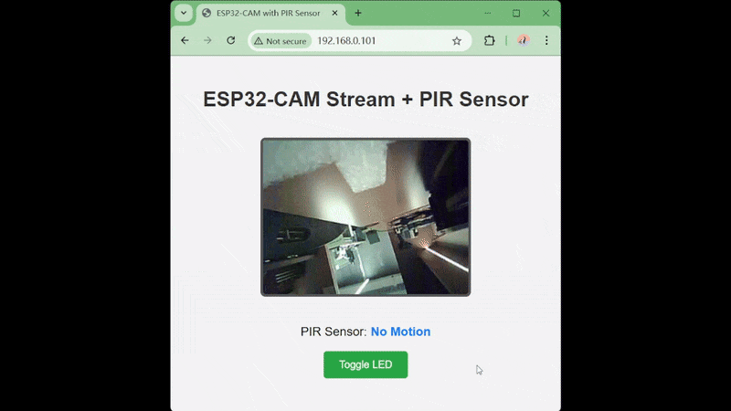
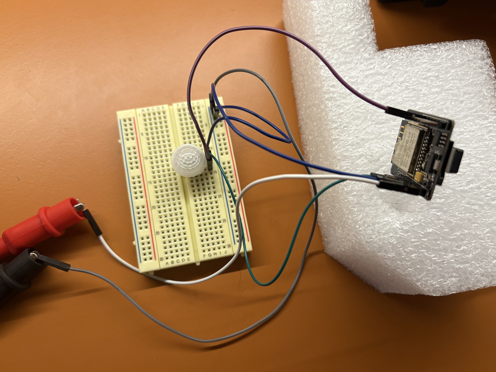

# Wi-Fi web server + Camera + PIR sensor + Flash light control

Now you're prepared for something more complex. Let's make it a bit more fancy by adding live feedback of a PIR sensor and a remote control button for the camera flash light. The project code can be found in this folder.

## Connection
In this section, you will need to connect a PIR sensor to your ESP32-CAM.
We use GPIO 13 to read the sensor output (OUT should be ~3.3V), connect:
- ESP GPIO 13 <--> PIR OUT
- ESP VCC (Outputs 3.3V) <--> PIR Vdd
- ESP GND <--> PIR GND <--> Ground (During runtime)
- ESP 5V <--> 5V power source (During runtime)


## Coding
The majority of the code is the same as the only camera demo. Let's talk about the changes.

1. Add PIR sensor and flash light handlers.
2. Run the camera stream handler on a separate core (multi-threaded).

### Define pins

```cpp
const int pirPin = 13;  // GPIO pin for PIR sensor
const int ledPin = 4;   // GPIO pin for flash LED
```
Define GPIO pins for the PIR sensor and the flash LED. I use pin 13 for the PIR sensor here.

### setup()

```cpp
  pinMode(pirPin, INPUT);
  pinMode(ledPin, OUTPUT);
```
The only changes in the `setup()` is the pin mode specification for PIR and flash light.

### loop()

```cpp
int pirState = digitalRead(pirPin);
```
In the loop(), we read the PIR pin first before handle any web clients.

```cpp
  if (req.startsWith("GET / ")) {
    serveWebPage(client);
    client.stop();
  } else if (req.indexOf("GET /stream") >= 0) {
    WiFiClient * newClient = new WiFiClient(client); // allocate on heap
    // Create a new task pinned to core 0 for streaming
    xTaskCreatePinnedToCore(
      streamTask,
      "StreamTask",
      10000,
      newClient,
      1,
      &streamTaskHandle,
      0
    );
  } else if (req.indexOf("GET /sensor") >= 0) {
    handleSensor(client, pirState);
    client.stop();
  } else if (req.indexOf("GET /led") >= 0) {
    digitalWrite(ledPin, !digitalRead(ledPin)); // toggle
    client.println("HTTP/1.1 200 OK");
    client.println("Content-Type: text/plain");
    client.println("Connection: close");
    client.println();
    client.println("LED toggled");
    client.stop();
  } else {
    client.println("HTTP/1.1 404 Not Found");
    client.println("Content-Type: text/plain");
    client.println();
    client.println("Not Found");
    client.stop();
  }
```

For the request handling part, the basic structure is still the same. We read the request, and use if sentences to handle different request. We add two new endpoints `/sensor` and `/led` for the PIR sensor and the flash light. 

For the PIR sensor, we send the response via the `handleSensor` function, which basically send `0` if no motion detected, and `1` otherwise.

```cpp
void handleSensor(WiFiClient client, int pirState) {
  client.println("HTTP/1.1 200 OK");
  client.println("Content-Type: text/plain");
  client.println("Connection: close");
  client.println();
  client.println(pirState); // sends 0 or 1 with newline
}
```

For the flash, simply toggle the LED when a client request is received, since there’ll be a toggle button on the web page.

```cpp
digitalWrite(ledPin, !digitalRead(ledPin)); // toggle
```

### Place the camera handle on another core

You've probably noticed this ugly thing:
```cpp
    else if (req.indexOf("GET /stream") >= 0) {
    WiFiClient * newClient = new WiFiClient(client); // allocate on heap
    // Create a new task pinned to core 0 for streaming
    xTaskCreatePinnedToCore(
      streamTask,
      "StreamTask",
      10000,
      newClient,
      1,
      &streamTaskHandle,
      0
    );
```
What this does is place our `streamTask` on another core so it can run in parallel with the main thread (which handles the sensor and flash LED). Why? Because the stream handler runs in an endless loop, sending images one after another. If we ran everything on a single core, the ESP would simply ignore any incoming client requests once it enters the streaming loop. But luckily, there are two cores on your ESP32-CAM: `Core 0` and `Core 1`. `Core 1` is where you usually runs your application code. `Core 0` typically handles Wi-Fi, Bluetooth, and low-level tasks, but it can handle some application tasks as well.

So this is what `xTaskCreatePinnedToCore` do - placing `steamTask` on `Core 0`. It starts a new [FreeRTOS](https://en.wikipedia.org/wiki/FreeRTOS) task (lightweight thread) to handle the video streaming.
```cpp
xTaskCreatePinnedToCore(
  streamTask,           // Function to run in the new task
  "StreamTask",         // Task name (for debugging)
  10000,                // Stack size in bytes (more than usual because JPEG buffers)
  newClient,            // Parameter passed into the task (the pointer to WiFiClient)
  1,                    // Priority (1 is low, 5+ is high)
  &streamTaskHandle,    // Handle to the created task (so you can later stop it if needed)
  0                     // Core ID (0 or 1) to pin this task to
);
```
The parameter we pass to the `streamTask` will on longer be the local variable `client`, but a pointer to it.
```cpp
WiFiClient * newClient = new WiFiClient(client);
```
`new` means: “allocate memory on the heap and give me a pointer.” So `newClient` is a pointer to a `WiFiClient` object, separate from the local `client` in `loop()`. This is needed because once we start a new FreeRTOS task, it might outlive the current scope of our `loop()`. If the `WiFiClient` was just a local variable, it would get destroyed when `loop()` continues, breaking our stream.

### Modify stream handle

```cpp
TaskHandle_t streamTaskHandle = NULL;
// Stream handler function (runs in separate task)
void streamTask(void* param) {
  WiFiClient client = *((WiFiClient*)param);
  delete (WiFiClient*)param; // free memory
  
  Serial.println("Client connected for stream");

  // Send HTTP headers for multipart MJPEG stream
  client.println("HTTP/1.1 200 OK");
  client.println("Content-Type: multipart/x-mixed-replace; boundary=frame");
  client.println("Connection: close");
  client.println();

  while (client.connected()) {
    camera_fb_t * fb = esp_camera_fb_get();
    if (!fb) {
      Serial.println("Camera capture failed");
      break;
    }

    client.println("--frame");
    client.println("Content-Type: image/jpeg");
    client.print("Content-Length: ");
    client.println(fb->len);
    client.println();
    client.write(fb->buf, fb->len);
    client.println();

    esp_camera_fb_return(fb);
    delay(50); // ~20 FPS
  }

  client.stop();
  Serial.println("Client disconnected from stream");
  vTaskDelete(NULL); // Delete this task when done
}
```
The majority of the stream handle is the same, we modified it so it can run on another core.

```cpp
TaskHandle_t streamTaskHandle = NULL;
```
This line declares a variable that can be used to keep track of our FreeRTOS task.

```cpp
  WiFiClient client = *((WiFiClient*)param);
  delete (WiFiClient*)param;
```
Inside the new task, `param` is that `void*` pointer we passed. We can cast it back to a `WiFiClient*`, then use `*` to dereference it, making a real `WiFiClient` object on the stack of this task. Now we no longer need the original heap pointer because we have a local copy to safely use inside this task. Therefore, we can clean up the memory we allocated on the heap with `new`.

```cpp
vTaskDelete(NULL);
```
After the task is complelely done, just delete the task.

### Webpage HTML & JavaScript

Now, on the webpage, we need to also display the PIR sensor feedback and a toggle button for the flash LED. The body of the HTML will change to:

```HTML
<body>
  <h1>ESP32-CAM Stream + PIR Sensor</h1>
  <br>
  <p>PIR Sensor: <span class="status" id="pir">loading...</span></p>
  <button onclick="toggleLED()">Toggle LED</button>
</body>
```
A couple of JavaScript will be needed as well:

```HTML
  <script>
    function fetchSensor() {
      fetch('/sensor').then(resp => resp.text()).then(text => {
        document.getElementById('pir').innerText = text.trim() == "1" ? "Motion Detected" : "No Motion";
      });
    }
    function toggleLED() {
      fetch('/led').then(resp => resp.text()).then(txt => {
        console.log("LED response:", txt);
      });
    }
    setInterval(fetchSensor, 1000);
    window.onload = fetchSensor;
  </script>
```
I will not dive into details here because this is not a web design unit. But basically every 1000ms, the browser should send a request to get information from the `/sensor` and `/led` endpoint. If `/sensor` message is `0`, change the span labelled `pir` to "No Motion", otherwise, change it to "Motion Detected".

As a final touch, some code to make the page looks pretty:
```HTML
  <style>
    body {
      font-family: Arial, sans-serif;
      background: #f4f4f4;
      text-align: center;
      padding: 20px;
    }
    h1 {
      color: #333;
    }
    img {
      border: 4px solid #555;
      border-radius: 8px;
      margin: 20px 0;
    }
    p {
      font-size: 1.2em;
    }
    .status {
      font-weight: bold;
      color: #007BFF;
    }
    button {
      padding: 12px 24px;
      font-size: 1em;
      color: #fff;
      background: #28a745;
      border: none;
      border-radius: 5px;
      cursor: pointer;
    }
    button:hover {
      background: #218838;
    }
  </style>
```

## Testing

Upload the new code `camera_pir_flash_led.ino` to ESP32-CAM. Connect the PIR sensor, power the ESP32-CAM, wait until it connects to Wi-Fi and then use a web browser to connect to it's IP. If everything goes right, you should see something similar to this:



