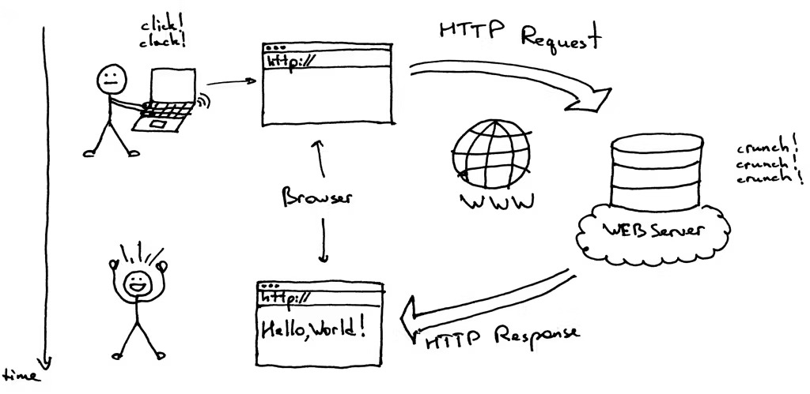

# Wi-Fi web server + Camera

Many online tutorials introduce you to the CameraWebServer example, which gives you a fancy web page that streams video from the camera and lets you adjust parameters like brightness. But for this unit, you probably couldn’t care less about taking fancy photos. So I’ve stripped it down to a simpler example and will explain each part.

## Connection

Simply connect your ESP32-CAM to the camera module. For programming, plug the ESP32-CAM into the adapter, then connect the whole setup to your computer.

## Coding

Find the code for camera only demo in this folder. `just_camera.ino` is the main file. 

### Setup

```cpp
#include "esp_camera.h"
#include "webpage.h"
#include <WiFi.h>

// Replace with your network credentials
const char* ssid = "YOUR_WIFI_SSID";
const char* password = "YOUR_WIFI_PASSWORD";

// Camera model
#define CAMERA_MODEL_AI_THINKER
#include "camera_pins.h"
```
The file `esp_camera.h` is not in your local project folder by default. It’s provided by the ESP32 Arduino core as part of the ESP32 Camera library, which gets installed in your Arduino libraries and hardware folders when you install the ESP32 board support.

The file `webpage.h` contains a customised webpage HTML and JavaScript. It's basically a file contains a char array called `webpage`, which is saved on the flash (program memory) to save RAM.

`WiFi.h` is the ESP Wi-Fi support package.

Here we define the Wi-Fi SSID and password for your ESP32-CAM to connect to. Replace them with your actual SSID and password.

We also define the camera model. We use AI thinker here.

The file `camera_pins.h` specifies the GPIO pins numbers for the camera pins. Don't touch it unless you know what you're doing.

### Create Wi-Fi server

```cpp
WiFiServer server(80);
```
This line creates a Wi-Fi server, which listens from incoming TCP connections on port `80` (The default port for HTTP web servers).

### Setup()
I'll explain the setup() and loop() first, then dive into other customised functions.
```cpp
void setup() {
  Serial.begin(115200);

  WiFi.begin(ssid, password);
  Serial.print("Connecting to WiFi");
  while (WiFi.status() != WL_CONNECTED) {
    delay(500);
    Serial.print(".");
  }
  Serial.println("\nWiFi connected");
  Serial.print("IP address: ");
  Serial.println(WiFi.localIP());

  startCamera();
  server.begin();
  Serial.println("Server started");
}
```
We first start a serial communication session, so we can print message to the screen. Notice that the rate is `115200`.

For the Wi-Fi, the code is very simple. We call `WiFi.begin(ssid, password)` to start a Wi-Fi session with the SSID and password you provided in the header. Then wait for ESP to connect to your Wi-Fi `while (WiFi.status() != WL_CONNECTED) {delay(500);}`. After it connects, it is important to print the IP address `Serial.println(WiFi.localIP());`. This is where we load our webpage.

After that, We start the camera using the function `startCamera` and the server by calling `server.begin();`.

### Loop()

```cpp
void loop() {
  WiFiClient client = server.available();
  if (!client) {
    return;
  }

  while (!client.available()) {
    delay(1);
  }

  String req = client.readStringUntil('\r');
  client.readStringUntil('\n');

  if (req.startsWith("GET / ")) {
    serveWebPage(client);
  } else if (req.indexOf("GET /stream") >= 0) {
    streamTask(client);
  } else {
    client.println("HTTP/1.1 404 Not Found");
    client.println("Content-Type: text/plain");
    client.println();
    client.println("Not Found");
  }
  client.stop();
}
```
In case you’re not sure, here’s how our web server works: first, the web server (the ESP32-CAM) initialises and waits for incoming requests from a client. A client, such as your web browser, sends a request to the server, and the server responds accordingly. This figure demonstrates it pretty well ([Source](https://hackernoon.com/http-made-easy-understanding-the-web-client-server-communication-yz783vg3)).



So in this loop, we first check if there’s a new client (e.g., your web browser) trying to connect to the ESP32’s web server. If there is no client, we wait.

```cpp
  WiFiClient client = server.available();
  if (!client) {
    return;
  }

  while (!client.available()) {
    delay(1);
  }
```

If we found a client, we wait until the client has actually sent some data.

```cpp
  while (!client.available()) {
    delay(1);
  }
```

If we have received a request, we read the first line of the data client sent, discarding `\r` and `\n`.

```cpp
  String req = client.readStringUntil('\r');
  client.readStringUntil('\n');
```

We really only care about the first line, which is typically formed like this: `GET / HTTP/1.1\r\n`. A client message is usually composed of three parts: method (`GET`) + path (`/`) + version (`HTTP/1.1`). So in this example, the message is pretty much: "Hey ESP32, please give me the content at / (your main page), following the HTTP/1.1 protocol." 

What's the point of doing `client.readStringUntil('\n');` after `client.readStringUntil('\r');`? Because after reading up to `\r`, we still have a leftover `\n` in the buffer. So doing `client.readStringUntil('\n');` clears it out, moving the read position past the `\n`. So the buffer is correctly positioned for the next line or next read.

```cpp
  if (req.startsWith("GET / ")) {
    serveWebPage(client);
  } else if (req.indexOf("GET /stream") >= 0) {
    streamTask(client);
  } else {
    client.println("HTTP/1.1 404 Not Found");
    client.println("Content-Type: text/plain");
    client.println();
    client.println("Not Found");
  }
  client.stop();
```

Now, depending on the client request, we send different responses. If the client requests for the main page (`/`), we response via `serveWebPage`. If they want the video stream (`/steam`), we repsonse via `streamTask`. Or, if the client requests are weird, we complain (`404 Not Found`). After responding, we should also close the current client session.


### Camera setup

Now the customised functions.

```cpp
void startCamera() {
  camera_config_t config;
  config.ledc_channel = LEDC_CHANNEL_0;
  config.ledc_timer = LEDC_TIMER_0;
  config.pin_d0 = Y2_GPIO_NUM;
  config.pin_d1 = Y3_GPIO_NUM;
  config.pin_d2 = Y4_GPIO_NUM;
  config.pin_d3 = Y5_GPIO_NUM;
  config.pin_d4 = Y6_GPIO_NUM;
  config.pin_d5 = Y7_GPIO_NUM;
  config.pin_d6 = Y8_GPIO_NUM;
  config.pin_d7 = Y9_GPIO_NUM;
  config.pin_xclk = XCLK_GPIO_NUM;
  config.pin_pclk = PCLK_GPIO_NUM;
  config.pin_vsync = VSYNC_GPIO_NUM;
  config.pin_href = HREF_GPIO_NUM;
  config.pin_sccb_sda = SIOD_GPIO_NUM;
  config.pin_sccb_scl = SIOC_GPIO_NUM;
  config.pin_pwdn = PWDN_GPIO_NUM;
  config.pin_reset = RESET_GPIO_NUM;
  config.xclk_freq_hz = 20000000;
  config.pixel_format = PIXFORMAT_JPEG;
  
  config.frame_size = FRAMESIZE_QVGA;
  config.jpeg_quality = 12;
  config.fb_count = 1;

  esp_err_t err = esp_camera_init(&config);
  if (err != ESP_OK) {
    Serial.printf("Camera init failed with error 0x%x\n", err);
    while(true) { delay(1000); }
  }
}
```
The `startCamera` function initialises pin numbers for the camera. You can find the exact values of variables such as `Y2_GPIO_NUM` in the `camera_pins.h` file.

`config.frame_size` sets the resolution of the camera image. Options include:
- FRAMESIZE_96X96 (96×96)
- FRAMESIZE_QQVGA (160×120)
- FRAMESIZE_VGA (640×480)
- FRAMESIZE_SVGA (800×600)
- FRAMESIZE_XGA (1024×768)
- etc.

`config.jpeg_quality` sets the JPEG compression quality, on a scale from 0 (highest quality, largest file) to 63 (lowest quality, smallest file).

`config.fb_count` sets the number of frame buffers the camera driver uses. `fb_count = 1` means it keeps only 1 frame buffer in memory. You can set 2 to allow double-buffering (capture to one while sending the other). That can improve streaming smoothness, but also needs more RAM.

```cpp
  esp_err_t err = esp_camera_init(&config);
  if (err != ESP_OK) {
    Serial.printf("Camera init failed with error 0x%x\n", err);
    while(true) { delay(1000); }
  }
```

This part basically initialises the camera and check if there is any error. And if there is any, print a message to the serial port.

### Steam handle

```cpp
// Stream handler function
void streamTask(WiFiClient client) {
  // Send HTTP headers for multipart MJPEG stream
  client.println("HTTP/1.1 200 OK");
  client.println("Content-Type: multipart/x-mixed-replace; boundary=frame");
  client.println("Connection: close");
  client.println();

  while (client.connected()) {
    camera_fb_t * fb = esp_camera_fb_get();
    if (!fb) {
      Serial.println("Camera capture failed");
      break;
    }

    client.println("--frame");
    client.println("Content-Type: image/jpeg");
    client.print("Content-Length: ");
    client.println(fb->len);
    client.println();
    client.write(fb->buf, fb->len);
    client.println();

    esp_camera_fb_return(fb);
    delay(50); // ~20 FPS
  }
}
```
This function repsonses to the client when receiving a request for the `/steam` endpoint. A response from the server is formed similar to a client request. We start by sending a header:
```cpp
  client.println("HTTP/1.1 200 OK");
  client.println("Content-Type: multipart/x-mixed-replace; boundary=frame");
  client.println("Connection: close");
  client.println();
```
`HTTP/1.1 200 OK` in human words is "Hey browser, I (the server) successfully understood your request and here’s the content you asked for."
- `HTTP/1.1` = we’re speaking the HTTP version 1.1 protocol.
- `200` = a success status code (like “all good!”).
- `OK` = a short human-readable phrase meaning exactly that: OK.

`Content-Type: multipart/x-mixed-replace; boundary=frame` - "Hey browser, I’m not just sending you a single image or page — I’m going to keep sending you a stream of separate parts (like a sequence of images), one after the other, each separated by a special marker called `--frame`. Please treat it as a live feed." This is a common hack for MJPEG video streaming over HTTP, where the server keeps sending JPEG images continuously to simulate a video. The browser knows each new frame starts when it sees `--frame`.

`Connection: close` - "Browser, after I send you this response, I’m going to close this network connection. Don’t expect to reuse it." And yes, we mention that we're going to close this connect before we send the message. Kind of strange, I know.

Remember to send a blank line to end HTTP headers.

```cpp
  while (client.connected()) {
    camera_fb_t * fb = esp_camera_fb_get();
    if (!fb) {
      Serial.println("Camera capture failed");
      break;
    }

    client.println("--frame");
    client.println("Content-Type: image/jpeg");
    client.print("Content-Length: ");
    client.println(fb->len);
    client.println();
    client.write(fb->buf, fb->len);
    client.println();

    esp_camera_fb_return(fb);
    delay(50); // ~20 FPS
  }
```
As mentioned in the header message, we are going to send a live stream of the video captured by the ESP camera. In this loop, we capture images by `camera_fb_t * fb = esp_camera_fb_get();` and send it to the client one by one. `esp_camera_fb_return(fb);` release the memory to be reused for the next image.

### Webpage handle
```cpp
void serveWebPage(WiFiClient client) {
  client.println("HTTP/1.1 200 OK");
  client.println("Content-Type: text/html");
  client.println("Connection: close");
  client.println();
  client.print(webpage);
}
```
This function handles the reponses when the server receives a request for the main page (`/`). Usually the browser only requests for the main page once when the browser is opened. This time, the content we send back is not a stream of video, but `text/html` as the webpage HTML that the browser needs to render. We send the `webpage`, which is from the `webpage.h` file. 

So what's in the `webpage`?

```cpp
const char webpage[] PROGMEM = R"rawliteral(
<!DOCTYPE HTML>
<html>
<head>
  <title>ESP32-CAM</title>
</head>
<body>
  <h1>ESP32-CAM Stream</h1>
  <br>
</body>
</html>
)rawliteral";
```
This is a simple webpage that only displays an 'image' that is connected to the `/steam` endpoint, which is our camera live stream.

## Testing

Now connect your ESP32-CAM to your computer via either a FTDI adaptor or an ESP32-CAM-MB adapter. Open the Arduino IDE and upload the code `just_camera.ino` to the ESP. After uploading, open a serial monitor and you should see some messages like this:
```
17:46:37.548 -> Connecting to WiFi....
17:46:39.540 -> WiFi connected
17:46:39.540 -> IP address: 192.168.0.101
17:46:39.733 -> Server started
```
This means your ESP has successfully connected to the Wi-Fi and started the web server. Now use a device that can open a browser to connect to the IP (In my case: http://192.168.0.101). If everything goes right, you should now see the live video on the browser.

If your ESP doesn't connect to Wi-Fi, double check the SSID and password you entered.